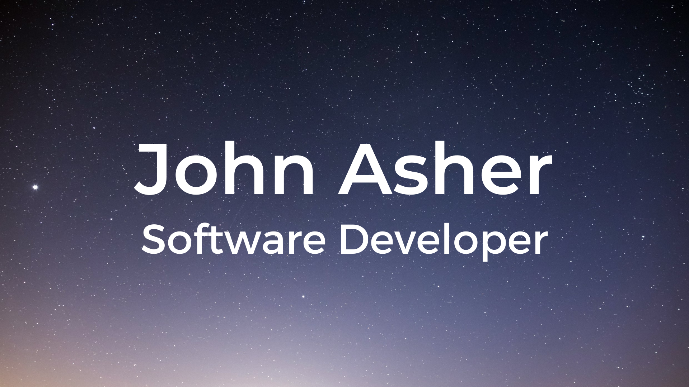

## 

## Hi, I'm John, a Software Developer, Artist and Maker.

🔴 My pronouns are **he / him / his**

🟠 I'm looking to collab on **projects**.

🟡 I come from a **Filmmaking** background.

🟢 I'm currently learning **Next.js** and **Tailwind CSS**.

🔵 I love talking tech (anything from **Homelabs** to **Formal Verification**).

🟣 I'm a huge sci-fi nerd: my identical twin and I both want to explore the the cosmos!

---

---

